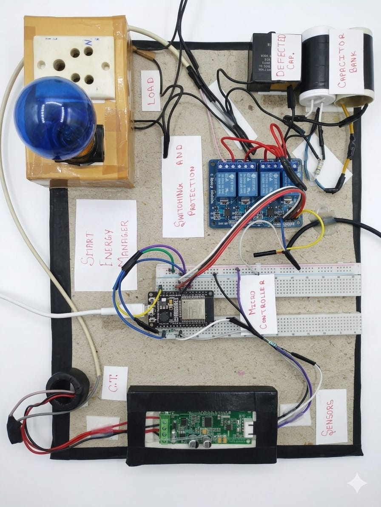
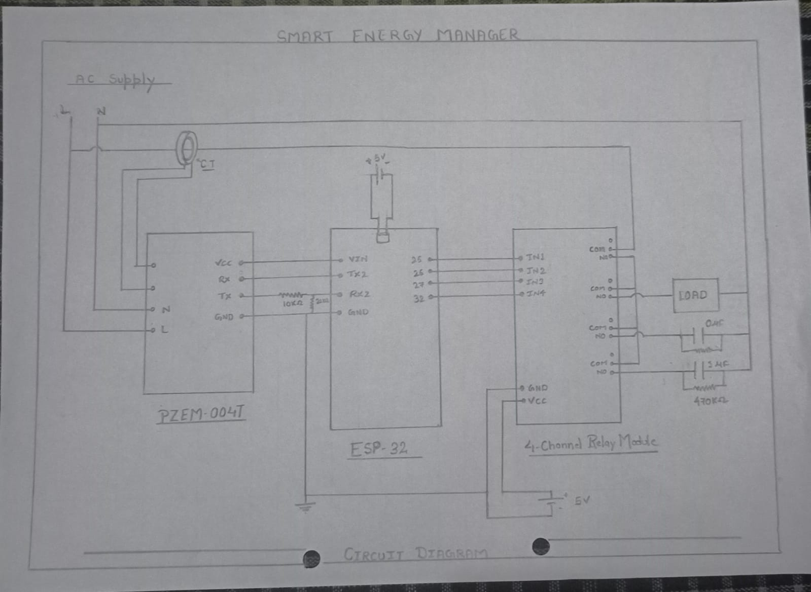
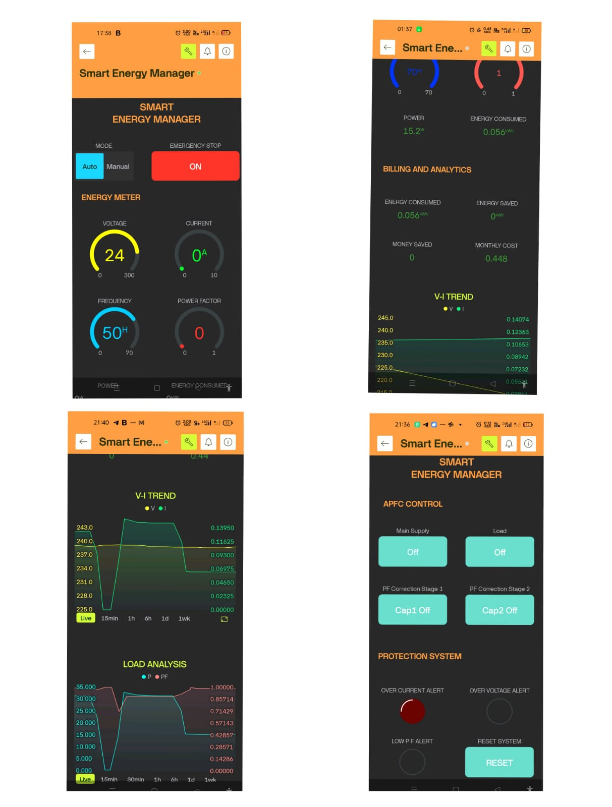
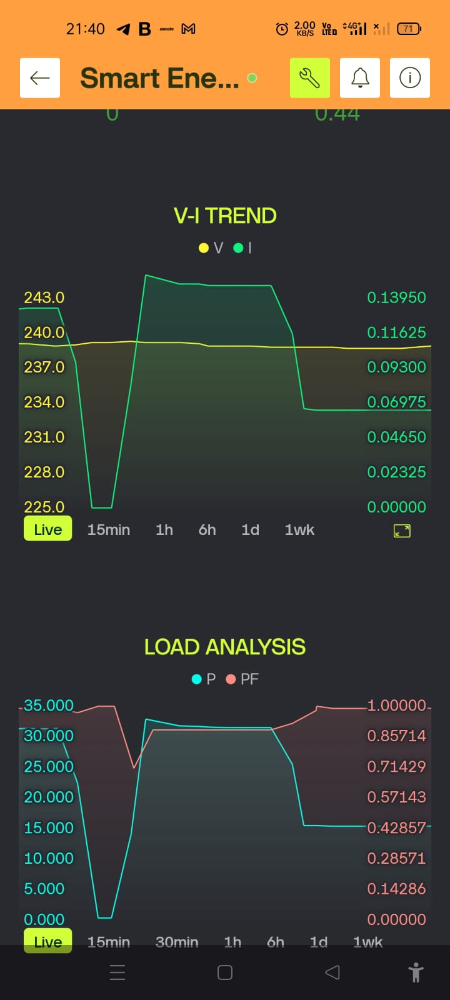
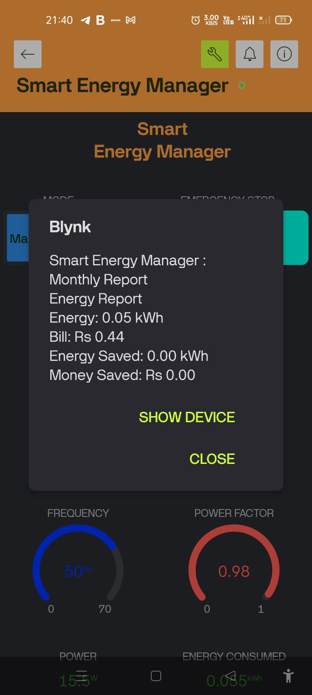
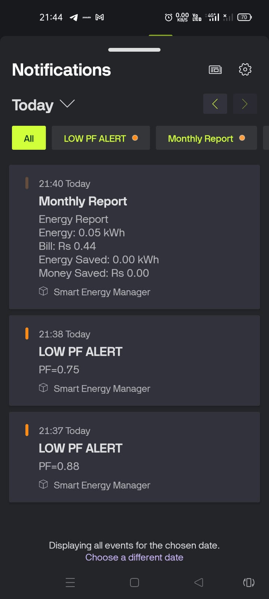

# Smart Energy Manager

## Overview

Smart Energy Manager is an IoT-based energy monitoring and protection system developed using ESP32 and PZEM-004T.

The system provides:

- Real-time monitoring of Voltage, Current, Power, Energy, Frequency and Power Factor
- Automatic Power Factor Correction (APFC)
- Over-voltage Protection
- Over-current Protection
- Emergency Kill Switch
- Cloud-based Monitoring using Blynk IoT
- Energy Cost Estimation and Reporting

## Hardware Used

- ESP32 Development Board
- PZEM-004T Energy Meter
- Relay Module
- Capacitor Bank
- AC Load
- Wi-Fi Network

## Software Used

- Arduino IDE
- Blynk IoT
- ESP32 Board Package

## Features

- Real-time Electrical Parameter Monitoring
- APFC Logic
- Remote Load Control
- Fault Latching Protection
- Mobile Dashboard
- Alert Notifications
- Billing Analytics

## Project Images

## Future Improvements

- MQTT Integration
- Three Phase Monitoring
- Cloud Database Storage
- Web Dashboard
- Load Forecasting

## Author

Chirag Chandan
B.Tech Electrical and Computer Engineering

## Project Demonstration

### Hardware Setup

### Circuit Diagram

### Dashboard

